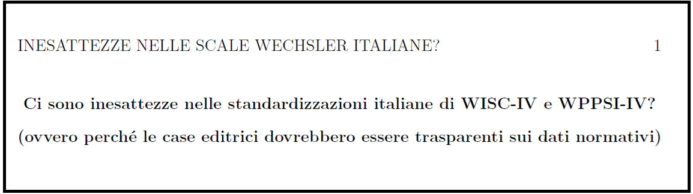

# PASSATO

## Dove eravamo?

Da anni *Giunti Psychometrics* (non da sola) produce e pubblica strumenti psicometrici che **NON riportano in chiaro i dati minimi necessari per verificare validità e attendibilità dei punteggi standardizzati e dei profili** (cioè: statistiche descrittive dei punteggi grezzi per ogni campione e subcampione, tabelle di conversione grezzo-ponderato, matrici di varianza e covarianza)


<!-------------------------------------->
<!-------------------------------------->

# PRESENTE

## Il *casus belli*

Le **scale Wechsler** in prossima uscita (*Wechsler Intelligence Scale for Children, 5^th^ Edition*; ***WISC-V***) sono solo l'ultimo caso di una serie, ma particolarmente significativo...

\small (Internazionalmente sono edite da *Pearson Assessment*, ma in Italia i diritti sono stati acquisiti da *Giunti Psychometrics*)


## Importanza delle scale Wechsler

- Ampiamente usate da professionisti e **sistema sanitario pubblico** come *"Gold Standard"*, informano **diagnosi** e **certificazioni** che hanno **valore legale** e grande **impatto sulla vita delle persone** 
- Per storia, tradizione, ma anche qualità, **in questo momento NON hanno adeguate alternative**, almeno in Italia
- **Potenziali alternative**, come la *batteria Kaufman* (*KABC-II*) e le *matrici di Raven* (*CPM*, *SPM*) sono **comunque edite da *Giunti Psychometrics* ** 


## Scale Wechsler: quali dati disponibili?

::: columns
:::: column
**Cosa c'era**

- \small Tabelle conversione grezzo-ponderato per tutte le fasce d'età (tuttavia NON statistiche descrittive *M* e *SD* dei punteggi grezzi, che però si potevano approssimare)
- \small Matrici di correlazione per tutte le fasce d'età e per il campione totale
- \small Stime di attendibilità 
- \small Alcuni confronti tipici-clinici
- \small Varie cose aggiuntive

::::
:::: column
**Cosa c'è/ci sarà**

- \small Statistiche descrittive dei punteggi standardizzati *(seriously, Giunti?!)*
- \small Stime di attendibilità (non riproducibili)
- \small Alcuni confronti tipici-clinici
- \small (*tutto lo scoring avviene esclusivamente online*)
::::
:::

## Il rischio

È accettabile che **diagnosi** e **certificazioni** con **impatto legale** e **sociale** si basino su punteggi/profili elaborati da un editore privato tramite una *"black box"* il cui **unico garante è lo stesso editore che vende i test**?


\small Ulteriori problemi riguardano didattica e ricerca.

## 

https://doi.org/10.17605/OSF.IO/H54QS

```{r figurafrontespizioinesattezze, echo=F, cache=T, out.width="100%"}

```


<!-------------------------------------->
<!-------------------------------------->

# FUTURO

## La via dell'accordo condiviso

**Cercare una mediazione** con *Giunti Psychometrics* e altre case editrici, che comunque da sempre collaborano in modo proficuo con accademici e professionisti, per una soluzione condivisa e **accettabile per entrambe le parti** (es. quali proposte al tavolo di martedì?)

## Class action #1

Chiedere l'introduzione di **linee guida stringenti** per il sistema sanitario pubblico.

*Esempio*: **NON si possono riconoscere valide diagnosi** che non siano supportate da strumenti con determinati standard di **trasparenza, qualità e verificabilità**.

\small Realizzabile?

## Class action #2

Chiedere l'istituzione di un'**authority pubblica**, con rappresentanti del mondo accademico e della professione, che abbia pieno accesso e **passi al vaglio TUTTI i dati** dei principali strumenti psicometrici ammessi per certe diagnosi che hanno valore legale (in stile *FDA* o *EMA* per i farmaci).

\small Realizzabile?

## Un'alternativa possibile?

**Fare a meno degli investimenti privati?**

Come comunità accademica, riconoscendoci attorno a valori condivisi, potremo realizzare noi stessi strumenti necessari e utili per l'interesse sociale *at large*?

Questioni:

- Servono finanziamenti: attingere a progetti/fondi pubblici nazionali ed europei!
- Maggiore riconoscimento del valore scientifico della pubblicazione di strumenti.


<!-------------------------------------->

